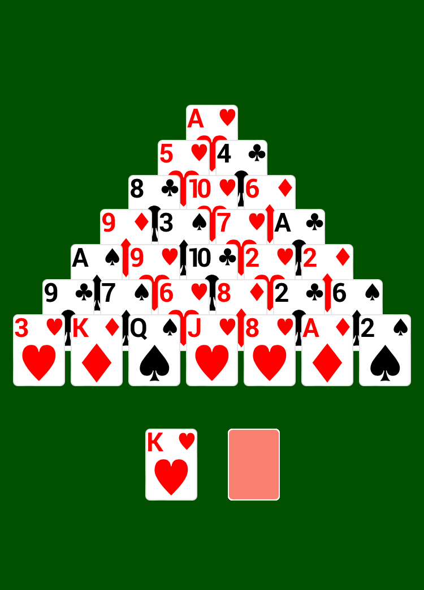

# Pyramid

Clear the game table by removing pairs of cards that add up to 13.  
You can [play Pyramid online](https://alex-berson.github.io/pyramid/) or  

## Description

**Pyramid** is a patience or solitaire game, which is played with a single pack of 52 playing cards. A pyramid of cards is dealt, consisting of 28 cards formed from seven overlapping rows. Each card in the top six rows is blocked by two cards in the row beneath. Both of these cards must be discarded before releasing the card above, making it available for play.

Pairs of exposed cards that total 13, the equivalent of the highest valued card in the deck, are discarded. The object of the game is to discard all 52 cards, demolishing the pyramid in the process. Aces count as 1, Jacks as 11, Queens as 12 and Kings, which total 13 by themselves, are discarded on their own.

Cards may be drawn from the stock one card at a time and placed into a waste pile, the top exposed card of which is always available for pairing. When the stock has been exhausted and no more pairs of 13 can be found, the game is over. 

## Screenshot

  

## License

Copyright &copy; 2021-2024 Alexander Berson. This project is licensed under the [MIT license](LICENSE.txt "MIT License").

